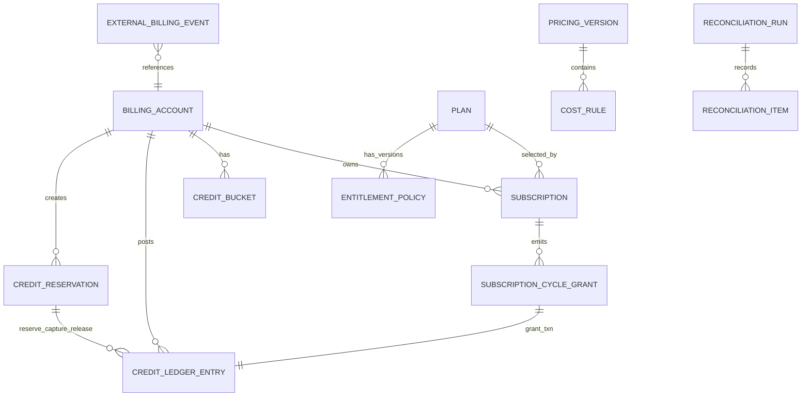

# Schema Draft + ERD Notes: Billing/Credits Phase 0

- **Document ID:** SCHEMA-DRAFT-BILLING-CREDITS-PHASE0-2026-02-23
- **Issue:** #57
- **Date:** 2026-02-23
- **Purpose:** Data-model readiness for implementation phases (#58/#59)
- **Companion:** `ARCH-PHASE0-BILLING-CREDITS-FOUNDATION-2026-02-23.md`

---

## 1) ERD (logical)

---

## 2) Table draft (implementation-oriented)

> SQL types are indicative and can be adapted to project conventions.

## 2.1 `billing_accounts`

- `id` uuid pk
- `owner_type` text check in (`user`,`workspace`)
- `owner_id` text not null
- `clerk_customer_id` text null
- `stripe_customer_id` text null
- `created_at` timestamptz not null default now()
- `updated_at` timestamptz not null default now()

Indexes:
- unique `(owner_type, owner_id)`
- index `(clerk_customer_id)` where not null
- index `(stripe_customer_id)` where not null

## 2.2 `plans`

- `id` uuid pk
- `plan_code` text unique not null
- `display_name` text not null
- `billing_interval` text check in (`month`,`year`)
- `price_minor` integer not null
- `currency` text not null default 'USD'
- `active` boolean not null default true
- `created_at` timestamptz not null default now()

## 2.3 `entitlement_policies`

- `id` uuid pk
- `plan_id` uuid not null fk -> plans.id
- `version` integer not null
- `effective_from` timestamptz not null
- `effective_to` timestamptz null
- `policy_json` jsonb not null
- `created_at` timestamptz not null default now()

Indexes:
- unique `(plan_id, version)`
- index `(plan_id, effective_from desc)`

## 2.4 `subscriptions`

- `id` uuid pk
- `billing_account_id` uuid not null fk -> billing_accounts.id
- `plan_id` uuid not null fk -> plans.id
- `authority` text check in (`clerk`,`stripe`) not null
- `authority_subscription_id` text not null
- `status` text not null
- `current_period_start` timestamptz not null
- `current_period_end` timestamptz not null
- `cancel_at_period_end` boolean not null default false
- `created_at` timestamptz not null default now()
- `updated_at` timestamptz not null default now()

Indexes:
- unique `(authority, authority_subscription_id)`
- index `(billing_account_id, status)`

## 2.5 `subscription_cycle_grants`

- `id` uuid pk
- `subscription_id` uuid not null fk -> subscriptions.id
- `cycle_start` timestamptz not null
- `cycle_end` timestamptz not null
- `granted_credits` integer not null
- `grant_ledger_txn_id` text null
- `created_at` timestamptz not null default now()

Indexes:
- unique `(subscription_id, cycle_start, cycle_end)`

## 2.6 `credit_buckets`

- `id` uuid pk
- `billing_account_id` uuid not null fk -> billing_accounts.id
- `bucket_type` text check in (`promo`,`subscription`,`topup`,`adjustment`,`overage`) not null
- `label` text null
- `expires_at` timestamptz null
- `created_at` timestamptz not null default now()

Indexes:
- index `(billing_account_id, bucket_type)`
- index `(expires_at)` where expires_at is not null

## 2.7 `credit_ledger_entries`

- `id` text pk (ULID)
- `billing_account_id` uuid not null fk -> billing_accounts.id
- `bucket_id` uuid null fk -> credit_buckets.id
- `txn_type` text not null
- `amount_credits` integer not null
- `idempotency_key` text not null
- `reference_type` text not null
- `reference_id` text not null
- `request_id` text null
- `reason_code` text null
- `metadata_json` jsonb not null default '{}'::jsonb
- `occurred_at` timestamptz not null
- `created_at` timestamptz not null default now()

Indexes:
- unique `(idempotency_key, reference_type, reference_id)`
- index `(billing_account_id, occurred_at desc)`
- index `(reference_type, reference_id)`

## 2.8 `credit_reservations`

- `id` uuid pk
- `billing_account_id` uuid not null fk -> billing_accounts.id
- `job_id` text not null
- `pricing_version_id` uuid not null
- `reserved_credits` integer not null
- `captured_credits` integer not null default 0
- `released_credits` integer not null default 0
- `status` text check in (`active`,`captured`,`released`,`expired`) not null
- `expires_at` timestamptz not null
- `created_at` timestamptz not null default now()
- `updated_at` timestamptz not null default now()

Indexes:
- unique `(job_id)`
- index `(billing_account_id, status)`
- index `(expires_at)` where status = 'active'

## 2.9 `pricing_versions`

- `id` uuid pk
- `version_code` text unique not null
- `status` text check in (`draft`,`active`,`retired`) not null
- `effective_from` timestamptz not null
- `effective_to` timestamptz null
- `created_at` timestamptz not null default now()

## 2.10 `cost_rules`

- `id` uuid pk
- `pricing_version_id` uuid not null fk -> pricing_versions.id
- `provider` text not null
- `operation_type` text not null
- `model_ref` text not null
- `rule_json` jsonb not null
- `created_at` timestamptz not null default now()

Indexes:
- index `(pricing_version_id)`
- index `(provider, operation_type)`

## 2.11 `external_billing_events`

- `id` uuid pk
- `authority` text check in (`clerk`,`stripe`) not null
- `authority_event_id` text not null
- `event_type` text not null
- `billing_account_id` uuid null fk -> billing_accounts.id
- `payload_hash` text not null
- `payload_json` jsonb not null
- `status` text check in (`received`,`processed`,`failed`) not null
- `error_code` text null
- `received_at` timestamptz not null default now()
- `processed_at` timestamptz null

Indexes:
- unique `(authority, authority_event_id)`
- index `(status, received_at)`

## 2.12 `reconciliation_runs`

- `id` uuid pk
- `job_name` text not null
- `window_start` timestamptz not null
- `window_end` timestamptz not null
- `status` text check in (`ok`,`warn`,`failed`) not null
- `mismatch_count` integer not null default 0
- `repair_count` integer not null default 0
- `started_at` timestamptz not null
- `finished_at` timestamptz null

## 2.13 `reconciliation_items`

- `id` uuid pk
- `run_id` uuid not null fk -> reconciliation_runs.id
- `item_key` text not null
- `severity` text check in (`SEV-1`,`SEV-2`,`SEV-3`) not null
- `category` text not null
- `details_json` jsonb not null
- `repair_action` text null
- `repair_status` text null
- `created_at` timestamptz not null default now()

Indexes:
- unique `(run_id, item_key)`
- index `(severity)`

---

## 3) Migration plan notes (Phase #58/#59 sequencing)

## 3.1 Migration batch A (catalog + subscription normalization)

1. Create `billing_accounts`, `plans`, `entitlement_policies`, `subscriptions`
2. Backfill mapping from existing user/workspace identifiers
3. Seed initial plan catalog + entitlement policy versions

## 3.2 Migration batch B (ledger core)

1. Create `credit_buckets`, `credit_ledger_entries`, `subscription_cycle_grants`
2. Add immutable ledger constraints and idempotency unique indexes
3. Seed free/starter grant bootstrap policies (if applicable)

## 3.3 Migration batch C (metering and settlement)

1. Create `pricing_versions`, `cost_rules`, `credit_reservations`
2. Seed pricing version `v1` and initial cost rules
3. Enable shadow-mode calculation paths

## 3.4 Migration batch D (eventing + reconciliation)

1. Create `external_billing_events`, reconciliation tables
2. Introduce scheduled reconciliation jobs in report-only mode
3. Flip repair mode after validation window

---

## 4) Data invariants to enforce in implementation

- Ledger is append-only; no update/delete API for `credit_ledger_entries`
- `subscription_cycle_grants` uniqueness prevents duplicate monthly grants
- Reservation close condition: `reserved_credits = captured_credits + released_credits`
- Balance snapshots (if materialized) are derivations and must be rebuildable from ledger stream

---

## 5) Open items for Phase #58 backlog grooming

1. Choose exact enum/value strategy (DB enums vs text + checks)
2. Determine partitioning strategy for ledger tables (if high write volume expected)
3. Define retention policy for raw external payloads
4. Confirm invoice storage approach (store metadata only vs sync PDF links)
